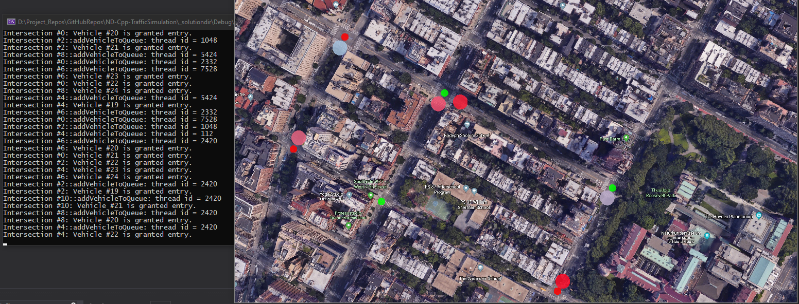

# ND-Cpp-TrafficSimulation
### *A concurrent traffic simulation project which uses OpenCV*

***

<ins>**Description:**</ins>

A concurrent traffic simulation application which uses **C++17** and **OpenCV** to display dots as vehicles moving along roads and reacting to traffic lights at intersections.
This project is my submission for the [Udacity Project](https://github.com/udacity/CppND-Program-a-Concurrent-Traffic-Simulation) which requires writing C++ code for concurrent program execution using threads, mutexes and locks.

This project uses the [OpenCV](https://github.com/opencv/opencv) library.

This project is specifically designed to generate Visual studio solution files easily and run on the Windows Operating System. It has a minimal [vcpkg](https://github.com/microsoft/vcpkg) installation with the libraries and the cmake toolchain file already setup.

***

<ins>**Cloning:**</ins>

Clone this project to a local destination using git: `git clone https://github.com/CybernetHacker14/ND-Cpp-TrafficSimulation`

***

<ins>**Pre-requisites:**</ins>

In order to generate the solution files, the following softwares need to be installed.

1. Visual Studio.
2. CMake.
3. PowerShell 7.0.3 or newer.

***

<ins>**Installation:**</ins>

1. Please check the [.gitignore](https://github.com/CybernetHacker14/ND-Cpp-TrafficSimulation/blob/main/.gitignore)
note, as it contains vital information.
2. Create a folder named `_solutiondir` in the outermost level of the repo, where the src and CMakeLists.txt files exists.
3. Inside that folder, open a PowerShell window and run the command `cmake --config "-DCMAKE_TOOLCHAIN_FILE=thirdparty\vcpkg\scripts\buildsystems\vcpkg.cmake" ..`

These steps will generate a Visual Studio solution file. Set the 'traffic_simulation' as the startup 
project, and run it.

***

<ins>**Screenshot:**</ins>

